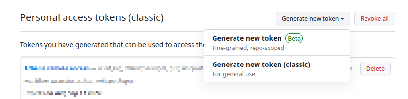
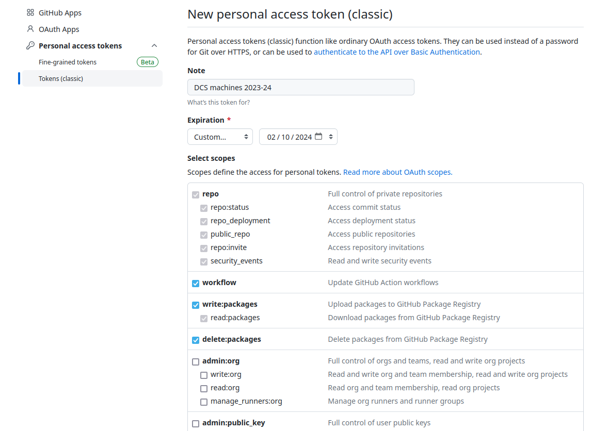
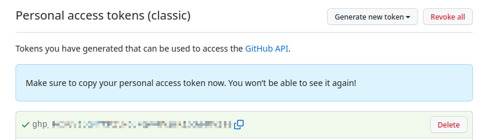

+++
title = "GitHub Authentication"
date = "2025-10-08"
+++

### Why do I need to do this?

For ✨security✨...

From August 2021, GitHub announced they would not be allowing password authentication
when using the command line to interact with github.com [^1].

In order to interact with GitHub from the command line, you have the options of SSH keys, or "authentication tokens".

We would recommend SSH keys, which Edmund has written a tutorial for [here](https://edmundgoodman.co.uk/posts/2024/github-ssh-authentication/).
> Some additional notes:
> - You may need to re-run `eval "$(ssh-agent -s)"` should you encounter an auth failure, particularly on the DCS machines.
> - You can also use `AddKeysToAgent yes` to your ssh config on the DCS systems, as outlined for macOS on the tutorial, to avoid having to repeatedly input your key's passphrase each time.
> - Failing this, add the key manually using `ssh-add path/to/keyfile`

The rest of this page will deal with the *authentication tokens* option.

### What are authentication tokens?

> An Authentication Token (auth token) is a piece of information that verifies the
> identity of a user to a website, server, or anyone requesting verification of the
> user’s identity.
>
> -- Twilio [^2]

### How do I create an authentication token?

Visit [https://github.com/settings/tokens](https://github.com/settings/tokens).
This can also be found by navigating to
"Settings>Developer Settings>Personal access tokens>Tokens (classic)"

You can then create a new token with the "Generate new token (classic)" button. You can
also create fine-grained tokens for individual repositories, but for general use classic
tokens are easier



After you have pressed this button, you may be prompted for 2-factor authentication.
Once you have authenticated, you should see a screen like this:



There are three things you want to set here:

1) Give your token a meaningful name! For example, if you plan to use it on DCS computers
   for the academic year starting in 2023, you could call it "DCS machines 2023-24".
2) Set an expiry date for your token. For convenience, you can set it to last a year
   using the custom date picker. Note there is a limit on how long tokens can last.
3) Select the scopes for the token. A possible general set of scopes for most tasks is:
   - `repo`
   - `workflow`
   - `write:packages`
   - `gist`
   - `notifications`
   - `user`
   - `write:discussion`
   - `audit_log`
   - `project`

Once you have set all these fields, click the green "Generate token" button at the
bottom of the page. After the button is pressed a screen like this should be shown:



The generated token should start with a `ghp_` prefix. **You must copy this token now!
You won't be able to see it once the page closes**

**This token acts like a password! You shouldn't show anyone it, and should revoke
it if anyone sees it**. To delete a token, click the delete button on the tokens page.


You can also read a different set of instructions for this process
[on the GitHub website](https://docs.github.com/en/authentication/keeping-your-account-and-data-secure/managing-your-personal-access-tokens#creating-a-personal-access-token-classic) [^3].

### How do I use it on my computer?

Once you have generated a token, you need to add it to the machine you intend to use it
on. There are various ways to do this, and which way depends on what your threat vectors
are, and how much setup you are willing to do.

In this tutorial, we will use the git credential `store` helper. This stores the token
in a plaintext format in your home directory. In some ways this is not ideal, but since
the file permissions are set to only be readable to your user account, and tokens can
easily be revoked if compromised it is generally and acceptable thing to do.

To store your token, in a terminal type [^4]:

```bash
git config --global credential.helper store
```

Then, make a commit or otherwise interact with the GitHub site from the command line.
You will be prompted for your username and password. Enter the email address for your
GitHub account for the username, and paste the token as the password.

You should then be able to make commits in future without being prompted for your
credentials again.

### What did that just do? (Optional)

To see where your credentials are stored, in a terminal type:

```bash
vim ~/.git-credentials
```

This will open the file, and you should be able to see your email and token in this file. 

You can also confirm the file permissions for this file as readable only by you by
typing in a terminal:

```bash
ls -alFh | grep credentials
```

Which should print something similar to:

```
-rw-------  1 <username> <username>   85 <date> .git-credentials
```

### References

- [^1] [https://github.blog/changelog/2021-08-12-git-password-authentication-is-shutting-down/](https://github.blog/changelog/2021-08-12-git-password-authentication-is-shutting-down/)
- [^2] [https://www.twilio.com/docs/glossary/what-is-an-authentication-token](https://www.twilio.com/docs/glossary/what-is-an-authentication-token)
- [^3] [https://docs.github.com/en/authentication/keeping-your-account-and-data-secure/managing-your-personal-access-tokens#creating-a-personal-access-token-classic](https://docs.github.com/en/authentication/keeping-your-account-and-data-secure/managing-your-personal-access-tokens#creating-a-personal-access-token-classic)
- [^4] [https://stackoverflow.com/a/64632086](https://stackoverflow.com/a/64632086)

